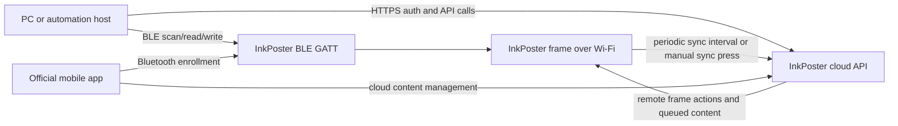

# InkPoster PC Connectivity Research Report

## Executive summary

InkPoster’s official control model is still overwhelmingly **mobile-app-centric**. Official manuals and FAQ pages say initial setup, Wi‑Fi onboarding, account pairing, image uploads, settings changes, and even firmware handling are performed through the InkPoster app; they also state that without the app, the device cannot receive new images or be customized. At the same time, those same official materials reveal that the frame uses **Bluetooth for local setup/pairing** and **Wi‑Fi/cloud sync for remote delivery**, which means there are at least two technical control planes worth investigating from a PC. citeturn23view0turn17view0turn16search10

The most important public reverse-engineering artifact I found is a recent Home Assistant custom integration, `mcuelenaere/ha-inkposter`. It is not an official project, but it is the only concrete, code-level public source I found that documents both the **cloud API** and the **BLE GATT interface**. That project exposes a workable path for PC-side control through Home Assistant or custom scripts: authenticate to InkPoster’s cloud API, enumerate frames, poll status, upload and convert images, and then tell a frame to display them; locally, it can discover `InkP-*` BLE devices, read a status characteristic, and send certain command frames such as fetch, reboot, and ghosting cleaner. citeturn4view0turn7view0turn9view0turn9view1

For practical PC use today, the best-supported route is therefore **not** an official Windows or Linux desktop client. Instead, it is either: **an Apple-silicon Mac running the iPhone app** in an unofficial-but-supported-by-Apple compatibility mode, or **a Home Assistant / custom-script workflow** built on the public reverse-engineering work. In the official sources I reviewed, I found Android and iPhone distribution, plus Apple lists Mac compatibility for the iPhone app on Apple Silicon; I did not find a separate official Windows desktop application in the reviewed materials. citeturn30view0turn31view0turn23view0

I did **not** find any public official firmware image repository, unpacked OTA packages, or vendor-published API documentation. Official support pages publish manuals, not firmware downloads, while official FAQ text says updates are handled through the app. The reverse-engineered Home Assistant integration exposes a firmware availability check and release-notes fields, but not a public OTA image catalog. I also did not find substantive public XDA or Stack Overflow protocol threads in the reviewed source set; the center of gravity of existing public research is GitHub rather than forums. citeturn10view0turn28search2turn23view0turn7view0turn27view0

## Official device and app baseline

InkPoster’s current public device lineup, as reflected in official product/support pages, includes **Affresco 13.3**, **Tela 28.5**, **Affresco 31.5**, and a **40.5-inch Duna** model; the support page currently links manuals only for the first three, while the 40.5-inch class appears on product pages and catalog/oEmbed metadata. The manuals and product specifications identify a low-power embedded platform with Wi‑Fi and Bluetooth, not a general-purpose desktop-managed appliance. citeturn10view0turn1search10turn24search16turn28search14

The official 28.5-inch manual lists an **MCU** and **RTOS** platform, **USB‑C**, **Wi‑Fi 2.4/5 GHz**, and **Bluetooth 5.2**. Official product specs for the product family list resolutions of **1200×1600** for 13.3-inch, **2160×3060** for 28.5-inch, and **2560×1440** for 31.5-inch. The manuals also confirm that devices ship in a deep-standby or shipping state and become operational after charging. citeturn17view0turn1search6

Official onboarding behavior is particularly important for PC access planning. The manual says the device must first be linked to an account in the **InkPoster mobile app**, and that connecting the frame for use is done **via Bluetooth**. Once linked, users can send art **remotely when they are out of Bluetooth range**, and the frame will fetch it according to the configured **sync interval**; a short press of the power button can also force device-side synchronization. This strongly suggests a split model in which **BLE handles enrollment and some local commands**, while **cloud/Wi‑Fi handles remote content delivery**. citeturn17view0turn23view0

Official documentation also gives precise reset behavior, which matters for recovery while experimenting. A **paperclip reset** reboots the device, while a **factory reset** is triggered by pressing the **power button seven times**. The FAQ adds that reset can also be initiated from the app menu while the phone is within Bluetooth range. After factory reset, the frame must be re-added to the account. citeturn17view0turn23view0turn13view1turn13view2

On the software side, the official Android package is **`inkposter.com`** on Google Play, published by **Pocketbook International SA**. The Play listing describes remote refresh, multi-device management, and future scheduling/automation, and shows an update date of **July 8, 2026** in the reviewed snapshot. Apple’s App Store listing uses app ID **`6736528324`** and says the app requires **iOS 18+**, while also being installable on **macOS 15+ with Apple M1 or later**, though it is the iPhone app rather than a purpose-built Mac desktop client. citeturn30view0turn31view0

The official privacy notice also confirms that the application/device ecosystem collects a substantial amount of technical telemetry, including **login data, time zone, device model, firmware version, device settings, and the image set to display**. Apple’s privacy labels additionally list **photos/videos** and **device ID** under app functionality, which is consistent with a cloud-assisted content-management workflow rather than a purely local BLE uploader. citeturn16search1turn31view0

## Reverse-engineered control paths

The clearest public reverse-engineering evidence comes from `ha-inkposter`, a Home Assistant integration released publicly on GitHub. Its README claims support for: cloud authentication with an InkPoster account; frame-status polling including battery, storage, Wi‑Fi, and firmware; image upload/display; and BLE discovery/commands for local device control. That README is significant because it establishes a repeatable, cross-platform PC control path through Home Assistant, even though it is unofficial. citeturn4view0

The reverse-engineered cloud client in that repository identifies the API base as an InkPoster v1 API and implements these flows: `POST /auth/login`, `POST /auth/refresh-token`, `GET /user/frames`, `GET /frame/status`, `GET /frame/image-status`, `GET /frame/version-check`, `GET /user/profile`, `POST /frame/actions`, `POST /item/convert`, `POST /item/is-converted`, and `POST /item/show-on-frame`. The code indicates that login uses **email, password, and a generated deviceId**, along with a **signed auth request** based on **HMAC-SHA256** and a timestamp; the login response then yields **accessToken**, **refreshToken**, and an **expiresIn** value treated as a Unix timestamp. Subsequent requests use **Bearer** authorization and an **`x-header-deviceid`** header. citeturn7view0turn9view1

That same project documents a full image-delivery workflow suitable for PC automation. The client first uploads the source image via multipart form data to `POST /item/convert`, then polls `POST /item/is-converted` until the queue completes, and finally calls `POST /item/show-on-frame` to associate the converted item with the chosen frame. In other words, the public evidence suggests that PC-side “show this image on my frame” is feasible using published unofficial research, provided you authenticate with **your own** InkPoster account and work within your own frame inventory. citeturn7view0

The BLE side is equally revealing. The Home Assistant integration declares a BLE **service UUID** of `706218ee-d3d6-46ad-8080-6eefbacf7dbc`, a **status characteristic** UUID of `aa5a52bb-e560-42b5-be83-7b79f7627f6d`, and a **command characteristic** UUID of `1b5f2d1a-8ff5-459e-a8de-73e13c051a13`. It also documents a device-name prefix of **`InkP-`** for discovery. The BLE status record is decoded as a **28-byte payload** containing state such as battery capacity, Wi‑Fi quality, message sequence, jobs, firmware components, and a model string. citeturn8view2turn9view0turn9view1

The published BLE code indicates that local commands are **HMAC-authenticated** and framed before being written to the command characteristic. It defines action IDs for **factory reset**, **set settings**, **reboot**, **hello**, **fetch**, **networks**, and **ghosting cleaner**. Most importantly, the `set_settings` command structure includes fields for **user**, **token**, **apiEnvType**, **SSID**, and **passwd**, which is strong evidence that BLE is used for at least some combination of local onboarding, Wi‑Fi provisioning, and token/bootstrap transfer. citeturn9view0turn9view1

One subtle but very valuable testing clue is the integration author’s note on pairing behavior. The BLE client explicitly avoids calling `pair()`, stating that the Android app does not pair and that, on macOS, pairing can cause link-layer encryption that corrupts writes from the device’s point of view. For a PC-based investigator, that suggests the safest first step is **scan and read GATT status without OS-level pairing**, especially on macOS. citeturn9view0

The local/cloud architecture that emerges from the official and unofficial sources looks like this:

This synthesis is supported jointly by the official manual/FAQ, which say Bluetooth is used to connect the frame and Wi‑Fi/cloud sync is used for remote delivery, and by the public Home Assistant code, which shows both a cloud API path and BLE GATT control path. citeturn17view0turn23view0turn4view0turn7view0turn9view0turn9view1

## Firmware, updates, and security posture

Official documentation says firmware handling is app-driven: the FAQ states that the application may handle system updates, and that without the app the device cannot receive new images or be customized. The Play and App Store listings also mention **push notifications for battery alerts, system updates, and important news**, reinforcing that update handling is surfaced through the mobile application rather than a vendor-published firmware portal. citeturn23view0turn30view0turn31view0

The reverse-engineered Home Assistant project adds another layer of detail. It polls `GET /frame/version-check`, and its sensor code expects update metadata fields such as **`newVersionAvailable`**, **`version`**, and **`releaseNotes`**. On the BLE side, status decoding yields a **three-part firmware format** (`fw_major.fw_minor.fw_build`), while cloud status appears to expose a string `firmwareVersion`. This means firmware state appears to be queryable from both planes, even though I did not find public downloadable OTA binaries. citeturn7view0turn27view0turn9view0

I did **not** find an official public firmware repository, public OTA payload directory, or unpacked firmware image set for InkPoster in the reviewed source set. The official support page currently publishes manuals and contact information, not firmware downloads. That does not prove no OTA files exist on vendor infrastructure; it only means they were **not publicly exposed in the sources I reviewed**. citeturn10view0turn28search2turn23view0

On security posture, the most important published facts are these. First, the reverse-engineered cloud client reports that the Android app embeds a client identifier and signing secret, and the BLE layer includes a default shared key used when the device is not in secure mode. Because those materials are already public in the repository, they are clearly part of the current reverse-engineering landscape; however, they should be treated as **sensitive** and used only for analysis of **your own account and hardware**. Second, the BLE status includes flags for **secure mode**, **Wi‑Fi link state**, **server socket link state**, **firmware update ready/error**, and **launcher command readiness**, which gives a PC investigator a useful non-destructive status surface before attempting any control writes. citeturn9view1turn9view0turn27view0

I also did not identify any InkPoster-specific, publicly indexed CVE entry or vendor security bulletin during this review. The public vulnerability infrastructure itself is, of course, available through CVE and NVD, but in the reviewed search set I did not surface a record tied specifically to InkPoster hardware, the mobile app, or the unofficial Home Assistant integration. That should be read as a **negative search result**, not as proof that no vulnerabilities exist. citeturn20search0turn20search1

A final operational detail matters for testing: the FAQ says **Power-Off mode** leaves the image visible but fully turns the device off so that it does **not maintain any connection to the server or app**. That means any PC-side cloud or BLE tests should first confirm the frame is awake, not merely displaying an image. Official app reviews also contain anecdotal reports of connectivity hangs and manual resets during image sending; I would treat those as low-confidence user reports, but they do match the need for cautious, incremental testing. citeturn23view0turn31view0

## Findings matrix

The table below is an analyst summary of the most relevant findings for PC access/control. “Risk” is my assessment of operational risk to the device or account if you reproduce the finding on your own hardware.

| Finding | Source | Type | Access method | Required credentials | Risk | Reproducibility |
|---|---|---|---|---|---|---|
| Official onboarding uses Bluetooth; remote delivery uses Wi‑Fi/cloud sync interval | Official manual + FAQ citeturn17view0turn23view0 | Official documentation | Mobile app or equivalent BLE/cloud implementation | InkPoster account for normal use | Low | High |
| Official reset/recovery procedures: paperclip reboot, seven-press factory reset, app-side reset in Bluetooth range | Official manual + FAQ citeturn17view0turn23view0turn13view1turn13view2 | Official documentation | Physical buttons; app when local | None for physical reset | High if factory reset | High |
| No public official desktop client surfaced; official distribution is Android/iPhone, with Apple-silicon Mac compatibility for the iPhone app | Google Play + App Store citeturn30view0turn31view0 | Official distribution | Android, iPhone, Apple-silicon Mac | App login | Low | High |
| Android app package name is `inkposter.com`; current public store metadata shows 2026 releases and remote/multi-device features | Google Play + APKPure + AppBrain citeturn30view0turn22view0turn15view0 | Official + third-party app metadata | Play install or sideload research | App login | Low on Play; Medium on sideload | High |
| APKPure hosts downloadable XAPK variants and version history including 2.1.1, 2.1, 2.0, 1.5.3 | APKPure citeturn22view0 | Third-party APK source | Sideload analysis | None to download | Medium | High |
| Home Assistant `ha-inkposter` integration is the main public third-party control project | GitHub README citeturn4view0 | Third-party project | Home Assistant | InkPoster email/password; optional BLE link | Medium | High |
| Reverse-engineered cloud API endpoints include auth, frame status, image status, version check, upload/convert/show-on-frame | GitHub `api_client.py` + constants citeturn7view0turn9view1 | Reverse-engineered API | HTTPS requests from PC/service | Your InkPoster account and issued tokens | Medium | High |
| Cloud auth appears to use email/password/deviceId plus signed auth requests, then Bearer access/refresh tokens | GitHub `api_client.py` citeturn7view0 | Reverse-engineered auth | HTTPS | Your InkPoster account | Medium | High |
| BLE GATT surface is publicly documented: service UUID, status characteristic, command characteristic, `InkP-*` discovery prefix | GitHub manifest + BLE/constants files citeturn8view2turn9view0turn9view1 | Reverse-engineered BLE | Local BLE from PC | Physical proximity; sometimes device/account state | Low for read-only, Medium-High for writes | High |
| BLE command set includes fetch, reboot, ghosting cleaner, factory reset, hello, networks, and a settings command carrying user/token/Wi‑Fi fields | GitHub BLE/constants files citeturn9view0turn9view1 | Reverse-engineered BLE | Local BLE writes | Physical proximity; your device | Medium-High | Medium-High |
| Firmware state is queryable through cloud and BLE, including update availability and release notes, but no public OTA image catalog surfaced | GitHub sensor/API code + official FAQ/support citeturn27view0turn7view0turn23view0turn10view0 | Mixed official/unofficial | HTTPS status polling; BLE status read | Your account for cloud; proximity for BLE | Low | Medium-High |
| Official privacy materials confirm telemetry around firmware version, device model, settings, and displayed image | Official privacy notice + App Store privacy labels citeturn16search1turn31view0 | Official privacy documentation | App/cloud ecosystem | App use | Low | High |
| Public CVE/NVD sources were checked, but no InkPoster-specific vulnerability entry surfaced in the reviewed results | CVE/NVD ecosystem reviewed during this investigation citeturn20search0turn20search1 | Negative search result | Public vulndb search | None | Informational | Low-Medium |
| Official support publishes manuals and support contacts, but not public firmware downloads or API docs | Official support page citeturn10view0turn28search2 | Official support | Manual download / support contact | None | Low | High |

## Safe testing leads

The safest non-destructive PC-side test is a **read-only BLE probe**. Scan for nearby devices whose names begin with `InkP-`, confirm the known service UUID, and read the published status characteristic without pairing. This should let you confirm proximity, model string, battery state, Wi‑Fi quality, and firmware version format before trying any command writes. The published Home Assistant code explicitly warns against BLE pairing on macOS, which makes passive scan/read a particularly good first move there. citeturn9view0turn9view1turn8view2

The safest cloud-side test is a **status-only session** using your own account. The reverse-engineered endpoint set suggests beginning with `GET /user/frames`, `GET /frame/status`, and `GET /frame/version-check`, because those are informational and do not alter displayed content. If you want a reproducible, low-friction implementation rather than writing your own client, the Home Assistant integration is the best starting point. citeturn7view0turn4view0turn27view0

A controlled content test should come only after status confirmation. The least risky functional write is usually to upload a benign test image to a non-critical frame and observe the cloud pipeline: convert queue, conversion completion, show-on-frame, then frame pickup on the next sync interval. The official manual says you can accelerate pickup with a short press of the power button, which gives you a clean way to compare **remote/cloud availability** against **local/manual fetch timing** without factory-resetting anything. citeturn7view0turn17view0turn23view0

If BLE range is inconvenient from your PC, a practical extension path is to use **Home Assistant Bluetooth** with an **ESPHome Bluetooth Proxy** or Home Assistant’s private-BLE tooling. That does not give you a “native InkPoster desktop app,” but it does provide a clean PC-operated bridge for local BLE control from elsewhere in the building. citeturn18search4turn18search15turn18search12

For your own-device traffic research, the safest toolchain is to combine a TLS-capable proxy such as **mitmproxy** or **Proxyman** with **Wireshark** for packet-level timing and transport observation. That is the right way to validate whether a phone-app action is purely local BLE, purely cloud, or a hybrid flow. Because the official app appears to rely on both BLE and cloud paths, that combined view is more useful than packet capture alone. citeturn18search3turn18search5turn18search8

The tests I would **not** put early in the sequence are factory reset, BLE settings writes, or any attempt to replay cloud auth material outside your own account context. The source set strongly suggests these are real control surfaces, but they are also the ones most likely to disconnect the frame, force re-enrollment, or create account-side confusion if used prematurely. Official reset behavior and the unofficial BLE `set_settings` command should therefore be treated as later-stage recovery or provisioning tools, not first-line experiments. citeturn17view0turn23view0turn9view0turn9view1

In practical terms, the current state of the public evidence supports this conclusion: **yes, PC access/control appears possible**, but primarily through **unofficial research artifacts** rather than through an official desktop program. The most reproducible published route today is **Home Assistant plus the `ha-inkposter` integration**, with BLE read/write for local control and the reverse-engineered cloud API for remote status and image workflows. Official sources make clear that InkPoster is designed for an app-first experience, but they also expose enough architectural detail that a careful PC workflow on your own devices is realistic. citeturn4view0turn7view0turn9view0turn23view0turn17view0